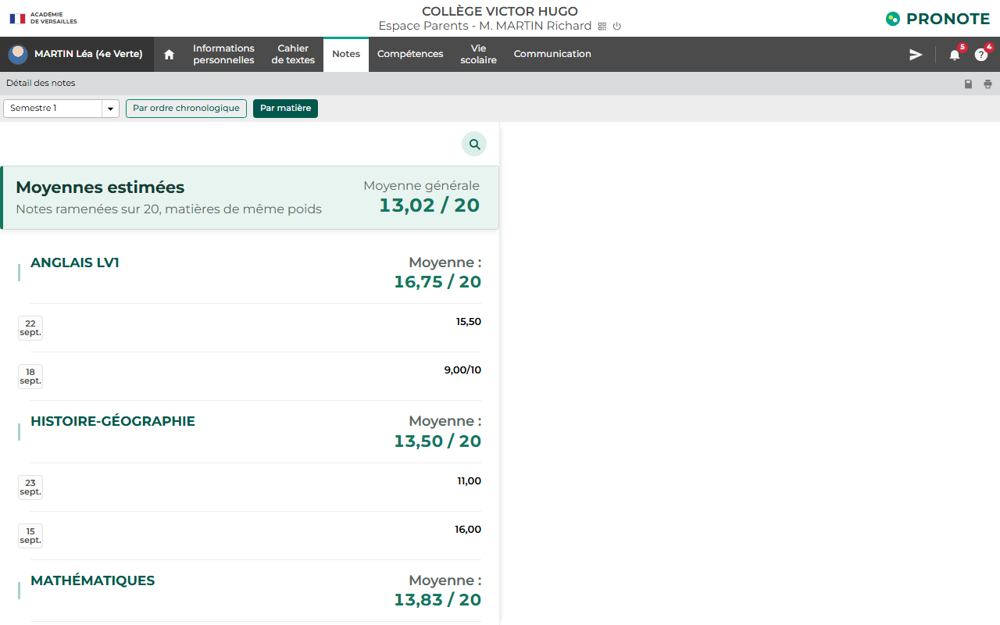
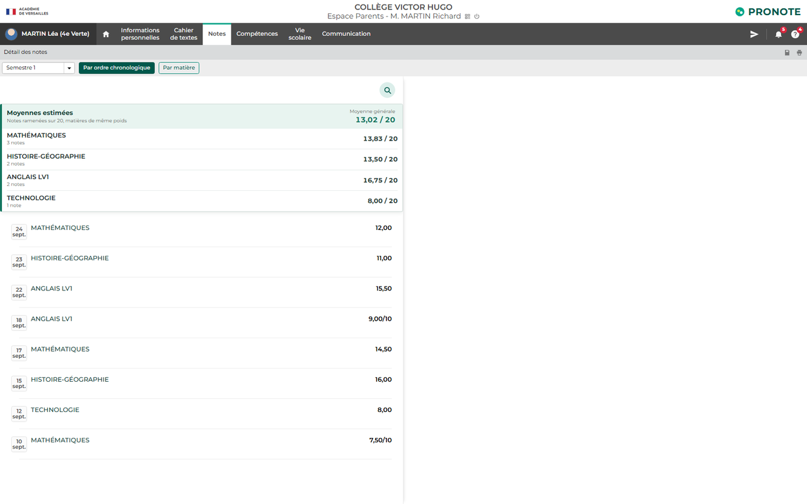

  

  
  
  

# Moyennes pour PRONOTE

Extension pour Microsoft Edge, Google Chrome et Mozilla Firefox. Elle affiche dans PRONOTE la moyenne de chaque matière et la moyenne générale estimée.

## À qui elle sert

Elle n'est utile **que si votre établissement n'affiche pas les moyennes** sur l'Espace Parents ou l'Espace Élèves. Si les moyennes y figurent déjà, l'extension n'apporte rien : fiez-vous aux valeurs officielles de PRONOTE.

Plusieurs réglages, décidés par l'établissement, expliquent cette absence :

- l'option **Ne pas afficher la moyenne générale** peut être activée pour tout l'établissement ;
- le **relevé de notes**, qui contient les moyennes, a une date de publication propre (par défaut en début de période) et peut être repoussé ;
- la page **Relevé** peut ne pas être publiée du tout sur les Espaces ;
- la publication des notes peut être **différée** sur l'Espace Parents par rapport à l'Espace Élèves.

Ces choix sont souvent motivés par la volonté de limiter la comparaison entre élèves et le stress lié aux notes. L'extension ne contourne aucune restriction d'accès : elle se contente de recalculer une estimation à partir des notes **déjà affichées** dans votre propre page.

- En vue **Par ordre chronologique**, toutes les moyennes sont regroupées dans l'encart.
- En vue **Par matière**, la moyenne générale reste en haut et chaque moyenne est alignée à droite avec les notes.

## 🖼️ Aperçu

  

  

<em>Captures réalisées avec des données fictives.</em>

## 🛠️ Installation

### Depuis les boutiques d'extensions

####  Microsoft Edge

**Publiée.** [Installer depuis Microsoft Edge Add-ons](https://microsoftedge.microsoft.com/addons/detail/moyennes-pour-pronote/ojbadlllbkeffagbklaklijmbplaiaaa)

####  Mozilla Firefox

**Publiée.** [Installer depuis Firefox Browser Add-ons](https://addons.mozilla.org/fr/firefox/addon/moyennes-pour-pronote/)

####  Google Chrome

**Publiée.** [Installer depuis le Chrome Web Store](https://chromewebstore.google.com/detail/moyennes-pour-pronote/lifbhekomedcmnpkgbcicjodhcfbdoei)

### Installation locale

L'extension est publiée sur les trois boutiques. Cette méthode sert à tester une version avant sa mise en ligne, ou à installer une version plus récente que celle actuellement distribuée.

Le [guide d'installation pas à pas](GUIDE_INSTALLATION.md) est conçu pour les personnes qui connaissent peu l'informatique.

Téléchargez [**Moyennes-pour-PRONOTE.zip**](https://github.com/SpartisPerso/moyennes-pour-pronote/releases/latest/download/Moyennes-pour-PRONOTE.zip), puis :

1. Double-cliquez sur **GUIDE_INSTALLATION.html**.
2. Suivez les cinq étapes illustrées.
3. Actualisez PRONOTE, puis ouvrez **Notes > Les notes**.

Le ZIP contient directement un sous-dossier `extension` prêt à être sélectionné dans le navigateur. Aucun fichier n'est copié ailleurs et aucune fenêtre ne s'ouvre automatiquement.

Les navigateurs imposent trois actions manuelles pour une extension qui n'est pas installée depuis une boutique : activer le mode développeur, charger l'extension décompressée et sélectionner son dossier.

Conservez le dossier extrait après l'installation : le navigateur lit directement son contenu.

## Calcul effectué

Deux méthodes sont proposées dans l'encart, via la liste **Notes :**.

| Méthode | Principe | Exemple avec 15,50/20 et 9,00/10 |
| --- | --- | --- |
| **Pondérées par leur barème** (par défaut) | Les points obtenus sont additionnés, puis rapportés au total des points possibles. Une note sur 10 compte donc moitié moins qu'une note sur 20. | (15,50 + 9) ÷ (20 + 10) × 20 = **16,33** |
| **Toutes à poids égal** | Chaque note est d'abord ramenée sur 20, puis toutes comptent pareil. | (15,50 + 18) ÷ 2 = **16,75** |

Le choix est mémorisé dans le navigateur, pour l'établissement concerné.

Dans les deux cas :

- Une note sans barème affiché est considérée comme étant sur 20.
- Toutes les matières ont le même poids dans la moyenne générale.
- Les absences et les résultats non numériques sont ignorés.

PRONOTE, lui, applique les coefficients définis par les professeurs et l'établissement. Les valeurs affichées par l'extension sont donc une **estimation**, qui peut différer des moyennes officielles.

## Confidentialité

L'extension lit uniquement les notes déjà présentes dans la page PRONOTE. Elle fonctionne entièrement dans le navigateur, n'envoie aucune donnée et ne demande aucune permission réseau.

[Politique de confidentialité](https://spartisperso.github.io/moyennes-pour-pronote/confidentialite.html)

## Fichiers principaux

- `extension/` : dossier à sélectionner dans le navigateur ;
- `GUIDE_INSTALLATION.html` : point de départ et guide visuel interactif ;
- `GUIDE_INSTALLATION.md` : guide complet consultable sur GitHub ;
- `store/` : textes et visuels pour les boutiques ;
- `tools/` : génération du logo et construction des paquets.

## Assistance

spartis.dev@outlook.com

Procédure de référence : [documentation officielle Microsoft Edge](https://learn.microsoft.com/microsoft-edge/extensions/getting-started/extension-sideloading).
